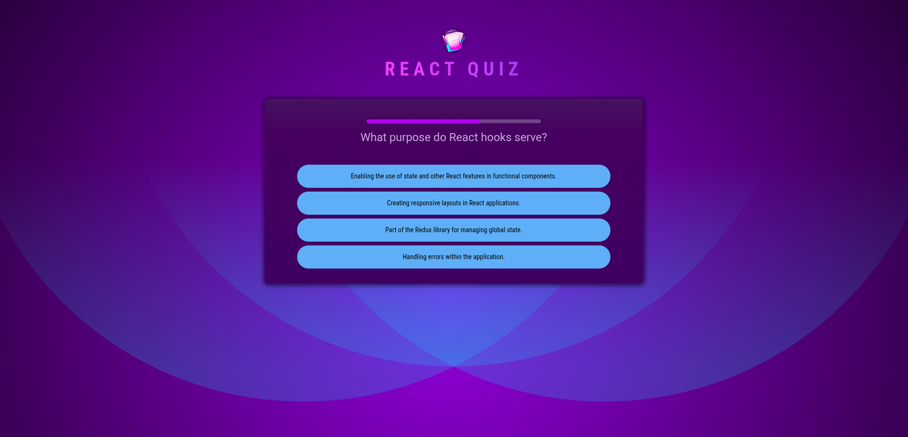

# Cart functionality



This project was developed as part of the **[React - The Complete Guide 2025 (incl. Next.js, Redux)](https://www.udemy.com/course/react-the-complete-guide-incl-redux/)** on Udemy.

## 📚 About

This repository contains the source code and related files for a project built during the React - The Complete Guide 2025 (incl. Next.js, Redux) course on Udemy, taught by Maximilian Schwarzmüller.  
The goal of the course was to learn React in-depth, using all the latest patterns and best practices.

## 🛠 Technologies Used

- React
- Javascript
- HTML, CSS

## 🚀 Getting Started

To run this project locally:

```bash
# Clone the repo
git clone https://github.com/Yulia-Mykytiuk/quiz-app.git

# Navigate into the project directory
cd quiz-app

# Install dependencies
npm install

# Start the development server
npm run dev
```

## 🎓 Course Information

**Course Title**: *[React - The Complete Guide 2025 (incl. Next.js, Redux)](https://www.udemy.com/course/react-the-complete-guide-incl-redux/)*  
**Instructor**: *[Maximilian Schwarzmüller](https://www.udemy.com/user/maximilian-schwarzmuller/)*  
**Platform**: [Udemy](https://www.udemy.com)

---

## 📄 License

This project is for educational purposes only and was created as part of a Udemy course.

This README file and project structure were created during my learning journey and are part of my portfolio.
